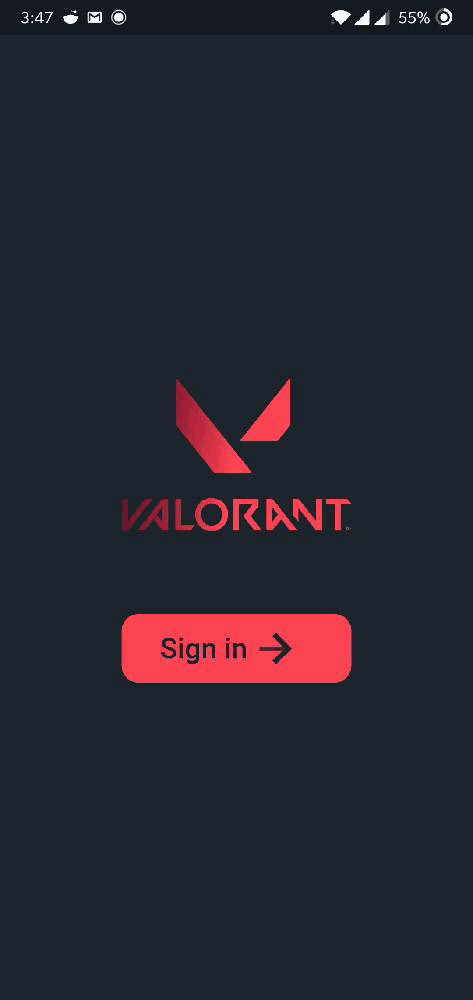
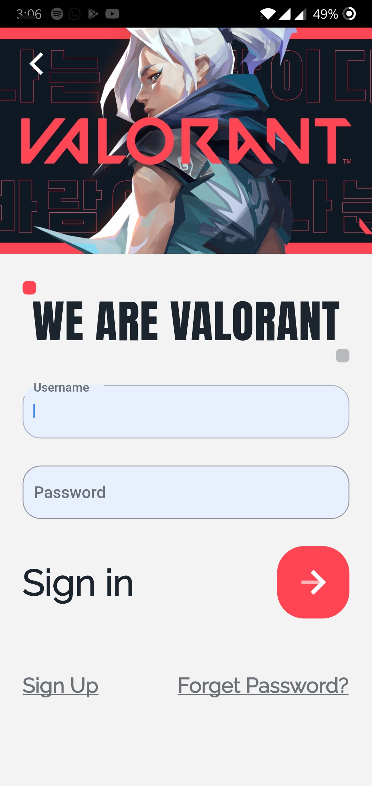
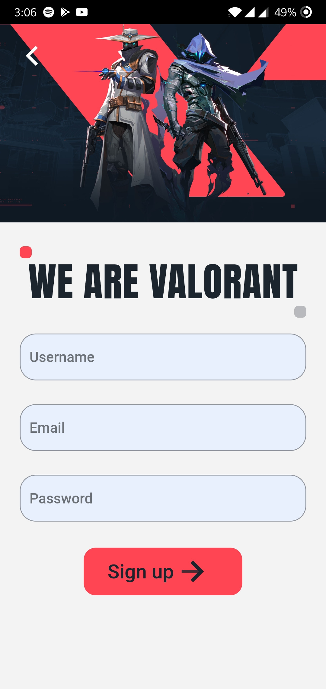
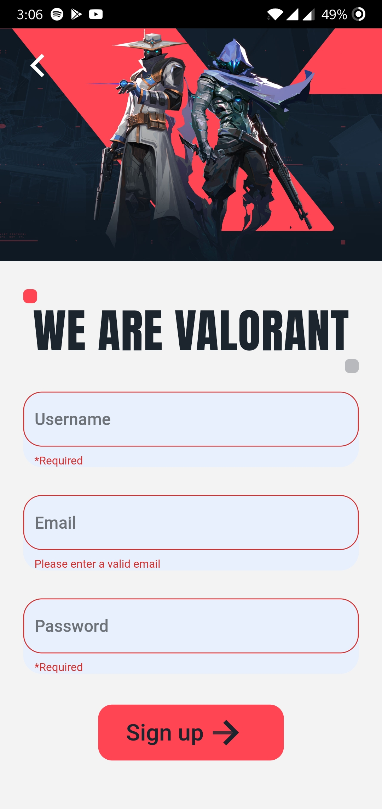
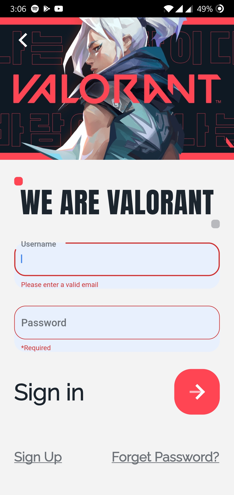
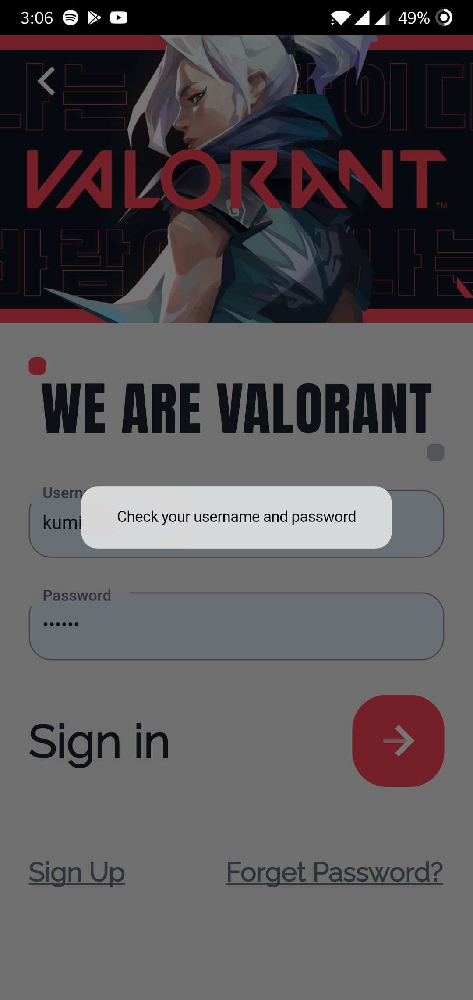
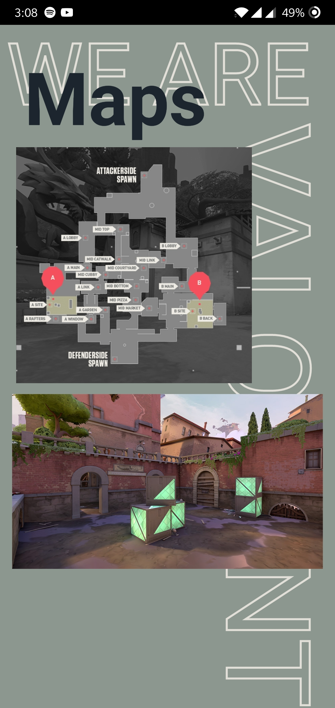

# valorant

A new flutter application. The application gives the user information about the several maps of the game valorant and the all the Agents. 

It's not completed yet.

## Screenshots

                           

## To Do
- [ ] Agent info Screen
- [ ] improve map page ui
- [ ] integrate api to get valorant news feed

